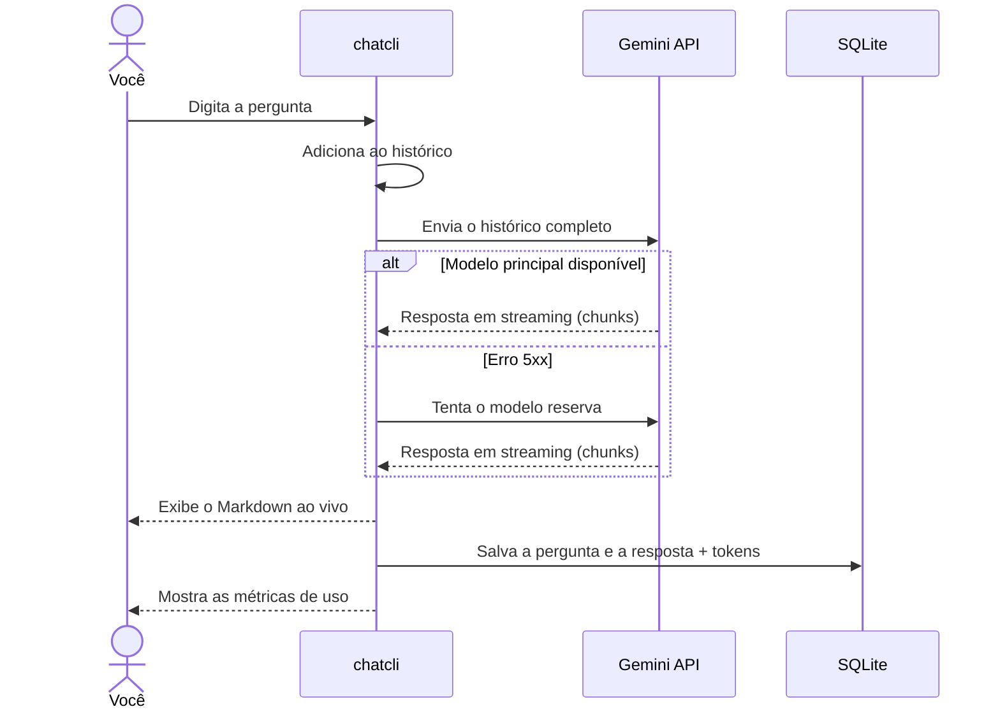
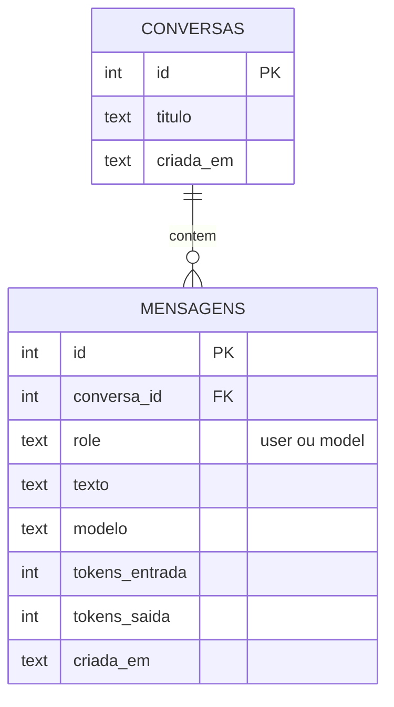

<div align="center">

# 💬 python_chat_cli

### Chat com IA direto no terminal, com streaming, memória de conversa e persistência em SQLite

<br>


<br>

<!-- Substitua pelo GIF do chat rodando no terminal -->
<!--  -->

[Funcionalidades](#-funcionalidades) •
[Como funciona](#-como-funciona) •
[Instalação](#-instalação) •
[Comandos](#%EF%B8%8F-comandos) •
[Roadmap](#%EF%B8%8F-roadmap)

</div>

---

## 📖 Sobre o projeto

Projeto de estudo em **Engenharia de IA**, construído em fases. Cada fase cobre um conceito usado em aplicações reais com LLMs: streaming, gestão de histórico, resiliência a falhas da API, persistência e controle de custo.

> [!NOTE]
> O objetivo não é só "chamar uma API", mas entender o que acontece por baixo: por que o custo cresce a cada pergunta, como lidar com um modelo fora do ar e como guardar e retomar o contexto de uma conversa.

---

## ✨ Funcionalidades

<table>
<tr>
<td width="50%" valign="top">

### ⚡ Streaming
O texto aparece conforme a IA gera, com **Markdown renderizado** no terminal: títulos, listas e negrito.

</td>
<td width="50%" valign="top">

### 🧠 Memória de conversa
O histórico é enviado a cada pergunta, então a IA **lembra do contexto** sem você precisar repetir.

</td>
</tr>
<tr>
<td width="50%" valign="top">

### 💾 Persistência
Conversas e mensagens ficam salvas em **SQLite** e podem ser **retomadas** a qualquer momento.

</td>
<td width="50%" valign="top">

### 📊 Métricas de uso
Tokens de **entrada, saída e raciocínio**, total e motivo da parada, exibidos a cada resposta.

</td>
</tr>
<tr>
<td width="50%" valign="top">

### 🛡️ Resiliência
**Retry** com backoff exponencial e **fallback** automático para um modelo reserva quando o principal falha.

</td>
<td width="50%" valign="top">

### ⌨️ Comandos
Liste, abra e limpe conversas **sem sair do chat**, com comandos no estilo `/comando`.

</td>
</tr>
</table>

---

## 🔄 Como funciona

Fluxo de uma pergunta, do terminal até o banco:



> [!IMPORTANT]
> APIs de LLM são **stateless**: elas não guardam nada entre chamadas. A "memória" do chat é o histórico reenviado a cada pergunta, e por isso os tokens de entrada **crescem a cada rodada**.

---

## 🛠️ Stack

| Tecnologia | Para que serve |
|:--|:--|
| **Python 3.14** | Linguagem do projeto |
| **[google-genai](https://pypi.org/project/google-genai/)** | SDK oficial da API do Gemini |
| **[rich](https://pypi.org/project/rich/)** | Spinner, Markdown ao vivo, tabelas e cores no terminal |
| **[python-dotenv](https://pypi.org/project/python-dotenv/)** | Carrega a chave da API a partir do `.env` |
| **SQLite** (`sqlite3`) | Banco local de conversas e mensagens |

---

## 📁 Estrutura

```
python_chat_cli/
├── 📂 src/
│   └── 📂 chatcli/
│       ├── 🐍 __main__.py   → Loop do chat, comandos, streaming e exibição
│       ├── ⚙️ config.py     → Chave da API, modelos, limites e caminho do banco
│       └── 🗄️ db.py         → Conexão, tabelas e consultas SQLite
├── 🔍 ver_banco.py          → Script de depuração do banco
├── 📋 requirements.txt
├── 🔑 .env.example
└── 🚫 .gitignore
```

---

## 🚀 Instalação

### Pré-requisitos

- Python 3.10 ou superior
- Uma chave de API gratuita do [Google AI Studio](https://aistudio.google.com/)

### Passo a passo

**1. Clone o repositório**

```bash
git clone https://github.com/VictorTadashi/python_chat_cli.git
cd python_chat_cli
```

**2. Crie o ambiente virtual e instale as dependências**

<details>
<summary>🪟 <b>Windows (PowerShell)</b></summary>
<br>

```powershell
python -m venv .venv
.\.venv\Scripts\Activate.ps1
pip install -r requirements.txt
```

</details>

<details>
<summary>🐧 <b>Linux / macOS</b></summary>
<br>

```bash
python3 -m venv .venv
source .venv/bin/activate
pip install -r requirements.txt
```

</details>

**3. Configure a chave da API**

Copie o arquivo de exemplo e coloque a sua chave:

```bash
cp .env.example .env
```

```env
GEMINI_API_KEY=sua-chave-aqui
```

> [!WARNING]
> Nunca suba o arquivo `.env` para o GitHub. Ele já está no `.gitignore`.

**4. Defina os modelos** em `src/chatcli/config.py`, usando os nomes listados no AI Studio:

```python
MODEL = "nome-do-modelo-principal"
MODEL_FALLBACK = "nome-do-modelo-reserva"
```

> [!TIP]
> Escolha um modelo reserva de **família diferente** do principal, por exemplo um *flash* e um *flash-lite*. Modelos de famílias diferentes raramente ficam sobrecarregados ao mesmo tempo.

**5. Execute**

```bash
cd src
python -m chatcli
```

O banco `chat.db` é criado automaticamente na raiz do projeto na primeira execução.

---

## ⌨️ Comandos

| Comando | O que faz |
|:--|:--|
| `/conversas` | 📋 Lista as conversas salvas, com ID, título, mensagens e data |
| `/abrir <id>` | 📂 Carrega uma conversa salva e continua de onde parou |
| `/limpar` | 🧹 Começa uma conversa nova (as anteriores continuam salvas) |
| `/historico` | 🔎 Mostra a conversa atual e quantas mensagens ela tem |
| `/sair` | 👋 Encerra o chat (`Ctrl+C` também funciona) |

<details>
<summary>💡 <b>Exemplo de uso</b></summary>
<br>

```text
Chat iniciado.
Comandos: /conversas | /abrir <id> | /limpar | /historico | /sair

Você: Meu nome é Victor e eu estudo na FIAP

IA:
Prazer, Victor! Como posso ajudar nos seus estudos hoje?

[gemini-...] entrada: 12 | saída: 14 | raciocínio: 0 | total: 26 | parada: STOP

Você: Qual é meu nome e onde eu estudo?

IA:
Seu nome é Victor e você estuda na FIAP.

[gemini-...] entrada: 41 | saída: 11 | raciocínio: 0 | total: 52 | parada: STOP

Você: /sair
Até mais!
```

Repare que a **entrada** subiu de 12 para 41 tokens: a primeira troca foi reenviada junto com a pergunta nova.

</details>

---

## 🗄️ Modelo de dados



<details>
<summary>📌 <b>Decisões de design</b></summary>
<br>

- **Título automático:** gerado a partir da primeira pergunta.
- **Sem conversas vazias:** uma conversa só é criada no banco quando recebe a primeira resposta.
- **Gravação consistente:** a pergunta só é salva junto com a resposta. Se a API falhar, nada é gravado.
- **Segurança:** todas as consultas usam parâmetros (`?`), o que evita SQL injection.
- **Caminho absoluto do banco:** evita que scripts rodados de pastas diferentes criem bancos vazios separados.

</details>

---

## 🧠 Conceitos praticados

<details>
<summary><b>APIs stateless e custo de contexto</b></summary>
<br>

A API não guarda a conversa. O histórico inteiro é reenviado a cada pergunta, então os tokens de entrada crescem a cada rodada e cada pergunta fica mais cara que a anterior.

</details>

<details>
<summary><b>Streaming</b></summary>
<br>

A resposta é consumida em chunks. O texto completo é montado somando os pedaços, e os metadados de uso (tokens) chegam no último chunk.

</details>

<details>
<summary><b>Tratamento de erros por classe</b></summary>
<br>

| Tipo | Exemplo | Estratégia |
|:--|:--|:--|
| **5xx** (servidor) | Modelo sobrecarregado | Retry com backoff e depois modelo reserva |
| **4xx** (cliente) | Chave inválida, modelo inexistente | Interrompe, porque repetir não resolve |

</details>

<details>
<summary><b>Gerenciamento de recursos</b></summary>
<br>

`try/finally` garante que a conexão com o banco, o spinner e a área de streaming sejam fechados em qualquer cenário, inclusive em caso de erro.

</details>

<details>
<summary><b>Separação de responsabilidades</b></summary>
<br>

Configuração (`config.py`), acesso a dados (`db.py`) e interface (`__main__.py`) ficam em módulos distintos.

</details>

---

## 🗺️ Roadmap

- [x] Chamada à API com métricas de tokens
- [x] Retry com backoff e modelo reserva
- [x] **Fase 1:** loop de conversa com histórico
- [x] **Fase 2:** streaming com Markdown renderizado
- [x] **Fase 3:** persistência em SQLite e comandos de conversa
- [ ] **Fase 4:** cálculo de custo em dinheiro por resposta e por conversa
- [ ] **Fase 5:** gestão de contexto com truncamento e sumarização do histórico
- [ ] System instruction para idioma e tom das respostas
- [ ] Comando `chatcli` instalável via `pyproject.toml`

---

<div align="center">

## 👤 Autor

**Victor Tadashi**

*Software Developer | AI Engineering*

<br>

[](https://www.linkedin.com/in/victor-tadashi-saito-barra-578b7a308)
[](https://github.com/VictorTadashi)
[](https://victortadashi.com.br)

<br>

⭐ Se este projeto te ajudou de alguma forma, deixe uma estrela!

</div>